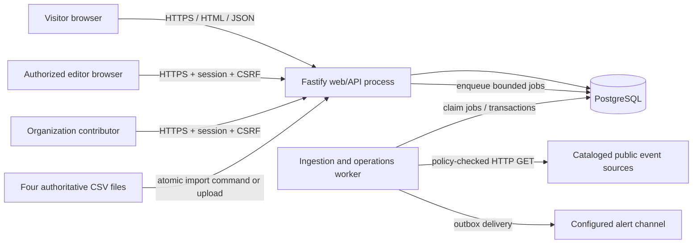
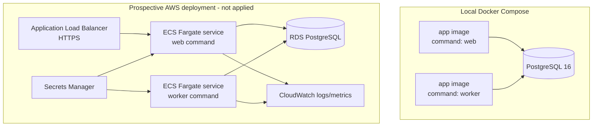
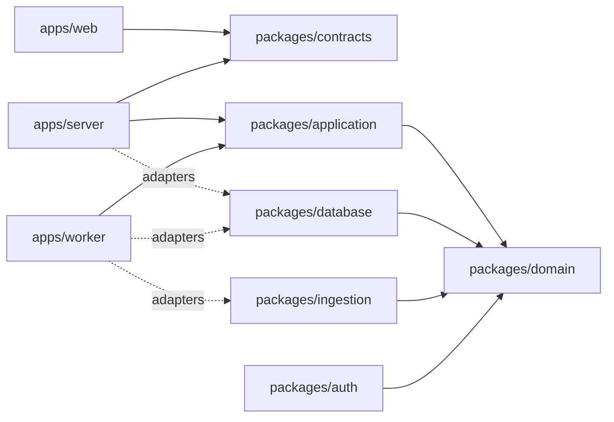
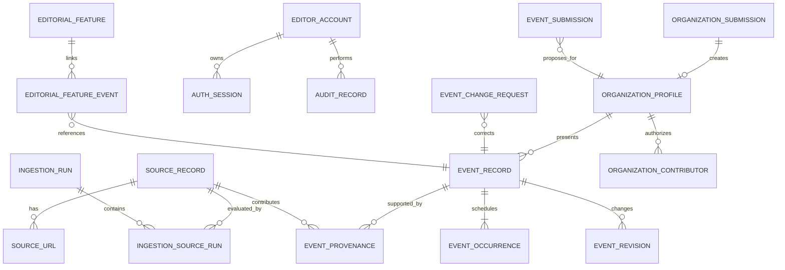

# Technical Design: DelawareScene Full-Stack Clean-Room Reimplementation

## Overview

### Purpose

This design defines an implementable, clean-room, full-stack reimplementation of the publicly observable DelawareScene event-discovery service. It covers the public website, a versioned backend API, authoritative CSV source import, bounded and policy-aware event ingestion, moderation, submissions, authentication, persistence, operations, automated validation, local development, containerization, and an AWS ECS-ready infrastructure definition.

The implementation is not a source-code or private-backend clone. It reproduces only behavior supported by the original request, the four authoritative source catalogs, publicly observable behavior, and independently documented design decisions. Unknown private behavior is either omitted or explicitly classified as an independent approximation in the clean-room ledger.

### Design goals

1. Deliver a working vertical slice locally with one language, one relational data store, and one container image.
2. Make business rules pure and testable while isolating HTTP, persistence, scraping, authentication, and rendering at explicit ports.
3. Preserve source provenance and moderation history transactionally.
4. Treat ingestion as untrusted, bounded, policy-aware work; never assume permission to crawl.
5. Serve an accessible, responsive, same-origin web application and documented `/api/v1` interface.
6. Remain deployable to ECS Fargate without introducing Kubernetes or mutating AWS during design and local validation.
7. Make every externally observable approximation traceable in a machine-validated clean-room ledger.

### Non-goals and explicit limits

- Recovering or representing inaccessible DelawareScene source code, database schemas, credentials, private data, ranking rules, or proprietary backend behavior.
- Reusing logos, photographs, fonts, copy, or other protected assets without documented permission.
- Running an unrestricted general-purpose crawler. Only enabled catalog records, bounded public URLs, supported formats, and allowed paths are evaluated.
- Mutating AWS resources during specification or ordinary local development.
- Introducing EKS. No requirement needs Kubernetes-specific scheduling, custom controllers, or multi-cluster operation; ECS Fargate is the lower-operational-cost fit.
- Providing legal, copyright, or security certification. The system records permission bases and test evidence so DDOA can perform the relevant reviews.

### Pragmatic implementation profile

| Concern | Choice | Rationale |
|---|---|---|
| Language/runtime | TypeScript on Node.js 22 LTS | One language across UI, API, worker, scripts, and infrastructure; Fastify 5 supports Node 20 and 22. |
| Workspace | `pnpm` monorepo with an exact lockfile | Fast installation and shared packages without publishing internal modules. |
| Public/moderation UI | React + Vite + React Router | Accessible component composition, direct route URLs, small build, and no SSR dependency for the required workflows. |
| Backend | Fastify 5 modular monolith | JSON-schema-driven HTTP boundary, low overhead, structured logging, and OpenAPI support. |
| Contracts | TypeBox JSON Schemas shared by API and generated client | Runtime validation and one source for TypeScript/OpenAPI contracts. |
| Persistence | PostgreSQL with Kysely and SQL migrations | Transactions, constraints, deterministic queries, advisory locks, full-text/trigram indexing, and portable local/AWS operation. |
| Date/time | `@js-temporal/polyfill` behind domain value objects | Explicit date-only, instant, timezone, and DST-safe calculations without relying on host-local time or experimental runtime support. |
| Background work | PostgreSQL job table + `FOR UPDATE SKIP LOCKED` worker | Avoids a queue service for the hackathon while supporting multiple ECS workers safely. |
| Authentication | Opaque server-side sessions, Argon2id password hashes, role checks | Locally runnable without a hosted identity provider; secrets remain external. An auth port allows a later OIDC adapter. |
| Property tests | Vitest + fast-check | TypeScript-native generated testing with a global minimum of 100 runs. |
| Browser/accessibility tests | Playwright + axe-core | Keyboard, URL restoration, reflow, form errors, and automated accessibility checks in real browser engines. |
| Packaging | Multi-stage OCI image; web and worker use different commands | One immutable artifact to validate, scan, and run in Compose or ECS. |
| Prospective AWS runtime | CDK v2 definition for ECS Fargate, ALB, RDS PostgreSQL, Secrets Manager, CloudWatch | Container-native deployment without Kubernetes administration. Synthesis and template diff remain local-only until an explicit deployment decision. |

Package manifests will pin exact versions and `pnpm-lock.yaml` will be committed. Major versions above are architectural constraints; implementation selects currently supported exact patch versions and updates them only through reviewed dependency changes.

### Research findings that shape the design

- [Fastify's support policy](https://fastify.dev/docs/latest/Reference/LTS/) lists Fastify 5 support for Node.js 20 and 22, supporting Node.js 22 as the common runtime.
- [AWS ECS on Fargate](https://docs.aws.amazon.com/AmazonECS/latest/developerguide/AWS_Fargate.html) runs isolated container tasks without operating EC2 clusters and supports Application Load Balancers, matching the desired low-operations deployment.
- [`cdk synth`](https://docs.aws.amazon.com/cdk/v2/guide/ref-cli-cmd-synth.html) creates a local cloud assembly and CloudFormation templates. This enables offline synthesis plus a repository-owned manifest diff without applying resources.
- [PostgreSQL transactions](https://www.postgresql.org/docs/current/tutorial-transactions.html) provide all-or-nothing visibility and rollback, which is used for event/provenance writes, catalog replacement, moderation, and audit records.
- [RFC 4180](https://www.rfc-editor.org/rfc/rfc4180.html) provides the quoted-field, escaped-quote, record, and line-ending basis for catalog parsing.
- [RFC 9309](https://www.rfc-editor.org/rfc/rfc9309.html) defines robots exclusion matching. The retrieval policy evaluates it before source requests and fails closed on explicit prohibitions.
- [Schema.org Event](https://schema.org/Event) defines commonly published event fields, including dates, location, attendance mode, status, and offers, making JSON-LD the first generic extraction format.
- [WCAG 2.2](https://www.w3.org/TR/WCAG22/) supplies testable accessibility criteria, including reflow, focus, keyboard operation, status messages, and accessible authentication.
- [OWASP CSRF guidance](https://cheatsheetseries.owasp.org/cheatsheets/Cross-Site_Request_Forgery_Prevention_Cheat_Sheet.html) recommends server-side synchronizer tokens for stateful applications and origin-oriented defense in depth; this design binds CSRF tokens to opaque sessions and actions.
- [fast-check configuration](https://fast-check.dev/docs/configuration/global-settings/) supports shared `numRuns`; the suite configures at least 100 runs globally and overrides upward for critical transformations.

Content from linked sources is summarized and rephrased for licensing compliance.

### Delivery slices

The design is complete for all requirements, but implementation should preserve a running system after every slice:

1. **Foundation:** monorepo, configuration, PostgreSQL, migrations, health, error envelope, logs, static React shell, Docker Compose.
2. **Catalog and ingestion core:** four-file import, source review, generic public-web adapter, JSON-LD/ICS/sitemap parsing, provenance, deduplication, run outcomes.
3. **Public discovery:** event index/detail, deterministic pagination, search/filter URL state, regions, organizations, features, podcasts, and opportunities.
4. **Operations:** local editor bootstrap, sessions/CSRF/RBAC, moderation transitions, revisions/audits, ingestion controls, source freshness and alerts.
5. **Submissions:** organization, event, correction, and opportunity forms and moderation queues.
6. **Hardening:** accessibility, property/contract/E2E/performance/security tests, backup/restore, clean-room ledger enforcement, container scan.
7. **Deployment readiness:** local-only CDK synthesis and manifest diff for ECS Fargate; no deploy is performed.

## Architecture

### System context



The browser and API are same-origin. Production Fastify serves the compiled Vite assets and `/api/v1`; development runs Vite with `/api` proxied to Fastify. Same-origin deployment simplifies cookies, CSRF, Content Security Policy, CORS, and local setup while preserving a strict code boundary between UI and backend contracts.

### Container and deployment view



The same immutable image is run with `node dist/apps/server/main.js` for HTTP traffic and `node dist/apps/worker/main.js` for queued work. The web process never performs long ingestion inline. The worker can be scaled separately while PostgreSQL job claiming and per-source advisory locks prevent duplicate concurrent work.

### Repository layout

```text
/
├─ apps/
│  ├─ web/                 # React routes, accessible components, API client
│  ├─ server/              # Fastify composition root and HTTP adapters
│  └─ worker/              # job polling, ingestion, alerts, retention
├─ packages/
│  ├─ contracts/           # TypeBox schemas, OpenAPI names, error envelope
│  ├─ domain/              # pure entities, value objects, policies, transitions
│  ├─ application/         # use cases and ports; no Fastify/PostgreSQL imports
│  ├─ database/            # Kysely mappings, repositories, SQL migrations
│  ├─ ingestion/           # CSV parser, URL policy, adapters, normalizers
│  ├─ auth/                # sessions, password verification, CSRF/RBAC policies
│  ├─ observability/       # logger, metrics, correlation, alert outbox
│  ├─ test-support/        # builders, fake clock, generators, fixture HTTP server
│  └─ ui/                  # design tokens and reusable accessible primitives
├─ clean-room/
│  ├─ behaviors.yaml       # exactly one record per implemented behavior key
│  ├─ assets.yaml          # permission/substitution inventory
│  └─ schemas/             # JSON schemas enforced in CI
├─ data/source-catalogs/   # exact supplied CSV files copied by setup/import task
├─ infra/cdk/              # ECS-ready CDK app; no lookup and no deploy by default
├─ scripts/                # import, seed, backup, restore, infra diff, release checks
├─ tests/                  # contract, integration, E2E, a11y, performance fixtures
├─ Dockerfile
├─ compose.yaml
├─ package.json
├─ pnpm-workspace.yaml
└─ pnpm-lock.yaml
```

Dependency direction is enforced with ESLint boundaries:



`domain` imports no frameworks, network clients, process environment, clocks, random generators, or database packages. Application use cases receive `Clock`, `IdGenerator`, repositories, transaction manager, HTTP source client, secret provider, and alert channel through interfaces.

### Request architecture

1. Fastify creates or validates a correlation identifier and establishes request-scoped logger fields.
2. TypeBox validates path, query, headers, and body before a handler runs.
3. Authentication loads an opaque session when present; authorization is checked before protected data is loaded.
4. The route maps the contract to an application command/query.
5. The application layer executes pure validation/policy functions and repository ports inside an explicit transaction for mutations.
6. The handler maps domain results to a documented response or the common error envelope.
7. A completion hook records status, template path, latency, and correlation ID and updates metrics.

No route returns persistence rows directly. Public mappers whitelist fields; moderation mappers are separate types so publication state, internal validation, submitter network data, and audit details cannot leak through accidental serialization.

### Public rendering architecture

The React application uses route-level loaders backed by a generated typed client. Search/filter state is canonicalized in `URLSearchParams`; changing criteria performs a history replacement within one second and resets to page 1. Opening a URL decodes only supported criteria, ignores unsupported filter values, and sends the canonical criteria to the API. The API remains authoritative for matching, publication visibility, ordering, and pagination.

Key routes:

| Route | Purpose |
|---|---|
| `/` | Public navigation, featured content, upcoming event preview |
| `/events` | Upcoming event index, search, filters, deterministic pages |
| `/events/:eventId` | Published event detail and future occurrences |
| `/regions/:slug` | Region-filtered published events |
| `/features/:slug` | Stable editorial feature URL and linked events |
| `/podcasts` | Published podcast index |
| `/opportunities` | Current arts opportunities |
| `/organizations/:slug` | Approved organization profile and future events |
| `/submit/organization` | Organization submission |
| `/submit/event` | Contributor event submission |
| `/events/:eventId/corrections/new` | Event correction request |
| `/submit/opportunity` | Arts opportunity submission |
| `/orgs/login` | Editor/contributor authentication |
| `/moderation/*` | Role-protected source, run, event, and submission review |
| `/about/faq` | Independently authored guidance and attribution |

The UI uses semantic HTML first: skip link, landmarks, one page heading, native buttons/links/inputs, fieldsets for filter groups, tables only for tabular moderation data, and dialogs only where modal behavior is necessary. Result changes use a polite live region without focus movement. At 400% zoom the layout collapses to one column with no fixed-width content or horizontally scrolling page; data tables use labeled card views below the reflow breakpoint.

### Time model

- Storage clock: UTC `timestamptz` for instants and audit/retrieval/submission timestamps.
- Business clock: injected `Clock`; tests use a fixed clock.
- Delaware calendar operations: IANA zone `America/New_York`.
- Date-only occurrence: stores `start_date`/`end_date` as SQL `date`, `time_kind='date'`, and no inferred time or zone.
- Timed occurrence: stores exact `start_at`/`end_at` instants plus source IANA zone and source-local date/time fields.
- “Upcoming” date-only means `start_date >= Delaware current date`. Timed means its applicable occurrence has not ended; if no end exists, `start_at >= pageOpenInstant`.
- Detail recurrence filtering uses the occurrence source zone as required. A page-open instant is captured once per request so records do not change classification midway through rendering.

Ordering tuple for public occurrences is:

```text
(local calendar date ASC,
 time-kind rank where date-only=0 and timed=1 ASC,
 source-local start time ASC NULLS FIRST,
 stable event UUID ASC,
 occurrence UUID ASC)
```

The occurrence UUID is only a final deterministic tie-break when two occurrences of the same event share all specified values.

### Search and pagination model

Search text is NFKC-normalized for comparison, trimmed, and case-folded by PostgreSQL's case-insensitive matching. The original submitted value is retained in the browser for validation feedback. A valid query is matched as one contiguous substring against title, description, organization, venue, city, and category. PostgreSQL `pg_trgm` GIN indexes support the required substring workload over 100,000 events.

Filter groups are joined with `AND`; selected values inside one group are joined with `OR`. Supported groups are date range, category, location/region, organization, source category, accessibility, cost, and audience. Public queries always add `publication_status='published'` and the relevant current/future predicate.

Page-number pagination is retained because the requirements require current/total page metadata and navigation to every page. Every collection uses a fully deterministic ordering and calculates `totalPages = totalCount === 0 ? 0 : ceil(totalCount/pageSize)`. Invalid page/page-size values fail before querying. A page beyond the final page returns an empty `items` array with valid metadata rather than silently changing page.

### Catalog import architecture

The import use case accepts exactly one of the four authoritative file names and derives its `Source_Category` from that name. It performs five stages before persistence:

1. Verify exact file name and determine category.
2. Decode UTF-8 and parse RFC 4180 records while retaining the first physical line number of each record.
3. Map accepted header aliases: `Site Map|Sitemap` and `Events|Event Page`; validate required columns.
4. Normalize every row into an immutable `CanonicalSourceRecordDraft`, accumulating field-specific errors.
5. If and only if there are no errors, replace/upsert that file's category in one transaction and mark new records enabled.

A known, zero-byte `Library Events.csv` or `Government Events.csv` is accepted as an empty category because the authoritative files are presently empty. A header-only file is also accepted. A zero-byte populated-category file is rejected as a missing-header error to reduce accidental destructive replacement.

URL fields use a tri-state value object:

```ts
type UrlField =
  | { kind: 'known-absence' }                 // exact NKS marker
  | { kind: 'unspecified' }                   // empty optional cell
  | { kind: 'values'; values: readonly AbsoluteHttpUrl[] };
```

Semicolon entries are split before URL parsing, trimmed, empty pieces removed, and order/cardinality retained. Bare valid domains gain `https://`; absolute `http://` and `https://` retain their schemes. Userinfo URLs, malformed hosts, control characters, and non-HTTP(S) schemes are invalid. Organization name and at least one organization URL are required on every non-empty row. No database write occurs until the full file is valid.

Canonical export uses a separate documented header containing `Source Category`, `Organization Name`, `Organization URL`, `Sitemap`, and `Event Page`. It quotes per RFC 4180, joins URL collections with `; ` in stored order, writes `NKS` for known absence, and writes an empty field for unspecified. Canonical export import is an explicit mode; ordinary authoritative import never trusts a row-supplied category.

### Pluggable ingestion architecture

```mermaid
sequenceDiagram
    participant E as Editor/API or Scheduler
    participant Q as PostgreSQL jobs
    participant W as Worker
    participant R as Robots/URL policy
    participant A as Adapter registry
    participant H as Safe HTTP client
    participant D as Domain normalizer
    participant P as PostgreSQL

    E->>Q: enqueue run with source IDs and page limit
    W->>Q: claim job (SKIP LOCKED)
    W->>P: advisory lock per source
    W->>R: evaluate URL and robots policy
    R-->>W: allow / prohibited
    W->>A: find all matching adapters
    alt zero adapters
      W->>P: unsupported-source outcome
    else more than one
      W->>P: adapter-conflict; no source request
    else exactly one
      W->>H: bounded conditional GET
      H-->>A: status, headers, bounded bytes
      A-->>D: event candidates / discovered pages
      D->>P: atomic event + provenance upsert
    end
    W->>P: final counts/outcome and unlock
```

#### Discovery URL selection

For each enabled source, the selector flattens event URLs in catalog order. If no event-specific value exists, it falls back to organization URLs followed by sitemap URLs. It removes exact normalized duplicates while retaining first occurrence, takes the first 100, and records the omitted count. Disabled sources are filtered before attempted counts and job creation.

#### Adapter selection

```ts
interface SourceAdapter {
  readonly key: string;
  supports(input: AdapterMatchInput): boolean; // pure; performs no request
  retrieve(input: AdapterRequest, deps: AdapterDependencies): Promise<AdapterResult>;
}
```

Selection evaluates all registered predicates. Zero matches is unsupported; more than one is a conflict and performs no source request; exactly one is used. Predicates are intentionally disjoint:

- A configured source-specific adapter matches only its exact `adapterKey` and source ID/domain rules.
- `PublicWebAdapter` matches unconfigured HTTP(S) sources only.
- Test fixture adapters match only the reserved local fixture mode and can never be enabled in production.

`PublicWebAdapter` is a composite parser behind one adapter identity. It detects bounded response formats and invokes pure parsers for XML sitemaps, iCalendar, JSON/JSON-LD, or HTML containing Schema.org JSON-LD. It does not scrape arbitrary visual text into events when structured data is absent; it records a supported-but-no-events outcome for moderator review. Source-specific adapters may be added when documented and fixture-tested.

#### Request safety and politeness

- Catalog HTTP and HTTPS schemes remain stored exactly, but retrieval never transfers event data over cleartext HTTP. An HTTP discovery URL is evaluated through a same-authority HTTPS upgrade; if TLS 1.2 or later cannot be established, the worker records `secure-connection-error` against the original URL and sends no fallback HTTP request.
- DNS results are checked before every request and redirect. Loopback, link-local, private, multicast, metadata-service, and non-routable addresses are rejected outside the reserved test fixture client.
- At most five redirects are followed; every target is revalidated.
- Per-request connect and total timeouts, maximum response bytes, maximum decompressed bytes, and allowed content types are configured.
- A descriptive product-token/User-Agent identifies the crawler and contact page.
- `/robots.txt` is evaluated per RFC 9309 before content. Explicit disallow, 401/403, or an unresolvable policy state stops requests for that source in the run and records `retrieval-prohibited`.
- Per-adapter maximum frequency, timeout, retry count, supported format, fields, and outcomes are required handoff metadata. Retries apply only to idempotent transient failures with bounded exponential delay and jitter.
- Page discovery is processed in source order and capped by validated run page limit `1..1000`. A discovered next page beyond the limit records `page-limit`.
- Tests use an injected fixture HTTP client and make no live third-party calls.

#### Event normalization and deduplication

Every parser emits `RawEventCandidate` plus source-supplied ID and URL. The pure normalization pipeline:

1. validates and normalizes title whitespace;
2. parses each occurrence as date-only or timezone-aware instant without inventing values;
3. preserves unknown optional fields as `null` plus field-presence metadata where needed;
4. validates URLs and literal text;
5. computes canonical location and versioned `CanonicalEventIdentity`;
6. assigns pending status to new records and flags invalid end ordering for review;
7. emits an immutable persistence command.

Canonical identity v1 is the SHA-256 digest of an unambiguous length-prefixed tuple:

```text
identity-version,
source-record stable ID,
NFKC + case-folded + whitespace-normalized title,
occurrence kind and exact date or represented instant,
NFKC + case-folded normalized venue/address/online-location key
```

Length prefixes prevent separator ambiguity. Identity rules are versioned and never silently changed. A unique index on `(identity_version, canonical_identity)` retains one current event. An upsert transaction attaches every provenance record, updates mutable event values when the identity is unchanged, and inserts the retrieval timestamp into history with a uniqueness constraint so one ingestion observation is appended exactly once.

A failed response creates no event. A failed or interrupted run does not delete, archive, or rewrite prior successful records. Retention/archival is a separate worker job operating only on eligible published occurrences.

### Moderation and lifecycle architecture

All lifecycle changes pass through entity-specific transition policies rather than accepting arbitrary status values.

| Entity | Allowed transitions |
|---|---|
| Ingested event | new → pending; pending → published; pending → rejected; published → archived |
| Organization submission | new → pending; pending → published/rejected; approval creates exactly one organization profile |
| Event submission | new → pending or rejected by eligibility; pending → published/rejected; approval creates/updates event |
| Event change request | new → pending; pending → published/rejected; approval applies only selected fields |
| Arts opportunity | new → pending; pending → published/rejected; published → archived |
| Editorial feature / podcast | new → pending; pending → published/rejected; published → archived |

For submission records, `published` is the durable approved terminal status; submission payloads themselves are never projected by a public endpoint.

A transition transaction locks the target, verifies expected current state, applies the transition, inserts revisions where values change, and inserts exactly one audit record. Invalid transitions and invalid rejection reasons roll back entirely. Database constraints enforce status values; append-only audit and revision tables reject application-role update/delete operations.

The ingestion preparation endpoint returns selected source identities, enabled states, and count before execution. Confirmation posts those IDs plus an optimistic `selectionVersion`; a changed source state causes a conflict rather than running a different selection. Run counts are nonnegative integers and a final invariant enforces `attempted = successful + failed`.

### Authentication and authorization architecture

- `editor_accounts` contain only an opaque account identifier, role (`editor` or `contributor`), state, credential reference, and timestamps. No email is required.
- Argon2id password hashes are authentication credentials and therefore live only in the designated `credential_secrets` vault, envelope-encrypted under a key obtained from `SecretProvider` and readable only by the auth repository role; ordinary application queries and DTOs cannot select them.
- A local bootstrap command reads the initial account ID/password from interactive secret input or a Docker secret, never command-line flags or source files, writes only the encrypted hash to the credential vault, and zeroes transient password buffers.
- Successful login issues a cryptographically random opaque token in a `Secure`, `HttpOnly`, `SameSite=Lax`, host-only cookie. Only its SHA-256 digest is stored in `auth_sessions`; sessions have absolute and idle expiry.
- Every protected request validates expiry and role before reading protected data. Missing/invalid/expired credentials return 401; authenticated insufficient role returns 403.
- State-changing browser requests require a session-bound synchronizer token in `X-CSRF-Token`, a matching action scope, an allowed `Origin`, and Fetch Metadata checks. Failure returns 403 with no mutation.
- Password verification, session rotation on login/privilege changes, constant-time token comparison, login throttling, and generic login errors reduce credential attacks.
- `AuthProvider` is a port so a later deployment decision can replace local credentials with OIDC authorization-code + PKCE without changing role policies or domain use cases.
- Local secrets live only in ignored `.env.local` or Docker secrets; prospective ECS tasks reference Secrets Manager ARNs. Logs redact secret-like keys and authorization/cookie headers.
- Every browser/API listener uses HTTPS with TLS 1.2 or later and HSTS outside certificate-bootstrap mode. Local setup generates an ignored development certificate; the ECS ALB and Fastify target both require TLS 1.2+, and PostgreSQL clients use verified TLS. A failed or downgraded secure connection returns no protected/event payload.

### Submission architecture

Public submission contracts are separate per form and validated in two passes: complete structural/field validation first, then security and eligibility policy. Any structural/security error rejects the entire request and persists nothing. Valid forms persist the immutable submitted payload, consent, terms version, UTC submission time, and encrypted source network address in one transaction.

Text is stored as literal plain text and rendered by React text nodes. A parser rejects actual HTML elements, scriptable SVG/XML, template directives, null/control payloads, and executable URL schemes; it does not treat ordinary punctuation such as `2 < 3` as markup. URLs are parsed structurally and allow only HTTP/HTTPS, plus `mailto`/`tel` where the selected contact type explicitly allows them.

Organization contributors may submit events only for an approved profile to which they are linked. Event occurrence arrays are de-duplicated by exact normalized occurrence key and constrained to `1..100`; the `2..100` requirement is treated as the stronger multi-occurrence case, while a one-occurrence submission remains valid under Requirement 19.34. Invalid end ordering rejects the submission, unlike ingestion where third-party bad data is retained pending with a validation issue.

A geospatial eligibility port receives a validated address/coordinate. The deterministic policy uses a versioned official Delaware boundary GeoJSON and geodesic distance; more than 25.0 miles is eligibility-rejected. Geocoding is an external adapter and never guesses: if coordinates cannot be established, the record remains pending with a manual eligibility check, not automatically accepted or distance-rejected. Invitation/membership/prior-affiliation restrictions reject; age, capacity, registration, or fee alone do not.

### Clean-room and asset governance

`clean-room/behaviors.yaml` is the implementation ledger. Each completed behavior key has exactly one record:

```yaml
- behaviorId: public.events.list.v1
  implementationStatus: complete
  basis:
    kind: requirement       # requirement | catalog | public-benchmark | independent
    reference: Requirement 6
  compatibility: reproduced # reproduced | independently-approximated | unsupported
  inaccessibleDependencies: []
  observableDifferences: []
  evidence: [tests/e2e/events-index.spec.ts]
```

A JSON Schema and CI script enforce unique `behaviorId`, exactly one basis, required difference/dependency fields for approximations, and a permitted status. Routes/features declare their behavior IDs in a registry; release validation fails if a completed registry behavior has zero or multiple ledger records.

`clean-room/assets.yaml` records asset identifier, owner/source, permission basis, attribution/copyright text, local substitute, and usage locations. The UI has no DelawareScene trademarks or third-party imagery by default; it uses system fonts, CSS shapes, and independently created tokens. Public content records carry attribution and rights-notice fields which are rendered when present.

### Reliability, cache, and concurrency

- PostgreSQL is the system of record. Mutations use explicit transactions and optimistic version columns.
- API processes have a bounded in-memory cache only for approved public list/detail responses. Keys include canonical query and a database `public_data_revision`; a short poll refreshes the revision. A mutation that changes public data increments the revision in its transaction. TTL and size bounds prevent stale/unbounded memory.
- Conditional HTTP requests use source ETag/Last-Modified when available, but a `304` never changes existing event values.
- Per-source advisory locks reject a second active run. Job leases include heartbeat and expiry; interrupted leases are failed with affected source IDs before retry.
- Idempotency keys are required for moderation and submission approval commands. Unique `(actor/session, endpoint, key)` records replay the original response without a second mutation/audit.
- Liveness reports process health without dependencies. Readiness checks a bounded `SELECT 1`; it becomes unhealthy within five seconds of database loss while liveness remains healthy.
- Backup uses `pg_dump` in custom format plus a manifest of schema version, row counts, relationship counts, and stable-ID hashes. Restore targets an empty compatible database, migrates if explicitly compatible, restores, and verifies the manifest before success.

### Observability architecture

- Pino emits one-line JSON logs to stdout. Request completion logs include UTC millisecond timestamp, severity, route template (not raw sensitive path), status, duration, and correlation ID within five seconds.
- Source-run records are durable database rows, not only logs, and contain UTC start/completion, outcome, counts, source, adapter, and bounded error category.
- `prom-client` metrics cover request count/latency/error count, ingestion outcomes, source freshness, published event count, queue depth, and alert delivery. `/metrics` is not public through the application router; local Compose exposes it on loopback and ECS security groups permit only the configured collector path.
- The worker evaluates freshness and alert conditions at least every 60 seconds. Alert state is durable and keyed by condition, which suppresses duplicates until recovery.
- Alert delivery uses a transactional outbox. Failed delivery remains visible as `pending`, retries at 60-second intervals up to three retries, and stores no secret payload. Local mode uses a console/file adapter; production accepts a reviewed webhook/SNS adapter through the same port.
- Correlation IDs connect HTTP commands, jobs, run outcomes, audit records, and alert attempts without placing credentials or full submitted text in logs.

### Local development and containerization

Prerequisites are Node.js 22, Corepack/pnpm, Docker with Compose, and Git. Supported setup is:

```text
corepack enable
pnpm install --frozen-lockfile
pnpm tls:dev:init
# Trust only the generated local development CA shown by the command.
docker compose up -d db
pnpm db:migrate
pnpm auth:bootstrap
pnpm catalog:import:all
pnpm dev
```

`pnpm tls:dev:init` uses a pinned utility container to create an ignored local CA and `localhost` certificate without committing private material; it prints explicit trust and removal instructions. `pnpm dev` starts HTTPS API and Vite listeners plus the worker and is intentionally a developer-run long-lived command. CI and agent validation use only terminating commands such as `pnpm test --run`, `pnpm build`, and `pnpm test:e2e` (Playwright is one-shot by default).

`compose.yaml` contains TLS-enabled PostgreSQL, `web`, and `worker`; source services use health dependencies and a named database volume, and only the HTTPS web port is browser-exposed. No third-party source is contacted by seed or test commands. A demo fixture adapter and local fixture server provide deterministic ingestion examples.

The multi-stage Dockerfile:

1. installs exact lockfile dependencies;
2. builds shared packages, server/worker, and static UI;
3. prunes development dependencies;
4. copies artifacts into a slim Node 22 runtime image;
5. runs as a numeric non-root user with read-only root filesystem compatibility, `/tmp` tmpfs, signal handling, and no shell-dependent startup;
6. exposes only the HTTPS application port and selects web/worker by command.

The image is tagged by an immutable `1..128` character version formed from release version plus full or unambiguous source revision. The release manifest binds image digest, source revision, lockfile hash, migration set, test report, and scan report.

### AWS infrastructure dry-run design

`infra/cdk` defines, but does not deploy:

- VPC and public/private subnet boundaries without environment lookups;
- internet-facing HTTPS ALB and security groups;
- ECS cluster and Fargate web/worker task definitions;
- configurable whole-number min/max scaling `1..100`, with `min <= max`;
- RDS PostgreSQL connectivity and backup settings;
- Secrets Manager references, not secret values;
- CloudWatch log groups, health checks, metrics/alarms, and alert destination reference;
- immutable image URI/digest input and release metadata;
- external DNS/certificate, source egress, and alert-channel inputs.

The default command is `pnpm infra:validate`, which type-checks, runs CDK synthesis with validation, lints generated templates, converts them to a normalized resource manifest, and diffs that manifest against the last reviewed baseline. The diff explicitly lists additions, modifications, and deletions or says none. It requires no AWS credentials and applies nothing.

No package script aliases `cdk deploy`. Validation-mode synthesis embeds an intentionally failing deployment-authorization rule, so accidentally deploying the ordinary local assembly is rejected during template preflight before resource changes. A separate future `pnpm infra:deploy --decision <path>` wrapper validates a signed deployment-decision document containing runtime `ecs`, environment, account, region, approver, expiry, allowed stacks, and rollback authorization, then creates a short-lived deploy-authorized assembly without that guard. The CDK app refuses deploy-authorized synthesis without a valid decision and decision-bound token, and the wrapper removes the temporary assembly after use. EKS constructs do not exist. Commands outside the repository remain an operator responsibility, but every project-produced assembly and supported mutating command is fail-closed without a decision.

Rollback metadata records releases and health intervals. The deployment wrapper permits only the immediately preceding image whose recorded production health was continuous for at least five minutes and never runs data rollback or destructive migrations. If no release qualifies, it exits before changing service configuration.

### Requirements-to-component traceability

| Requirements | Primary design components |
|---|---|
| 1, 17 | Clean-room behavior/asset ledgers, handoff metadata, docs schema, release gate |
| 2 | Catalog importer/serializer, URL value objects, catalog transaction repository |
| 3 | Discovery selector, adapter registry, robots/SSRF-safe HTTP client, worker/run outcomes |
| 4 | Event normalizer, occurrence/time model, canonical identity, event/provenance transaction |
| 5 | Ingestion preparation, source locks, moderation transition service, revisions/audits |
| 6–9 | Public query service, deterministic ordering/pagination, search/filter parser, React routes, `/api/v1`, OpenAPI |
| 10, 13 | Sessions, Argon2id, RBAC, CSRF, literal text handling, rate limiter, secret/log redaction |
| 11 | Semantic UI primitives, keyboard/reflow/live-region behavior, Playwright/axe checks |
| 12 | Indexes/cache, load tests, job leases, health endpoints, backup/restore verifier |
| 14 | Vitest, fast-check, integration/contract/E2E/a11y/security/performance suites |
| 15 | Structured logger, metrics, freshness evaluator, durable alerts/outbox |
| 16 | Docker image/release manifest, offline CDK synth/manifest diff, guarded ECS deployment wrapper |
| 18 | Region/feature/podcast/opportunity/organization query modules and routes |
| 19 | Submission validators, contributor authorization, eligibility policy, approval/revision workflow |

## Components and Interfaces

### Shared contract conventions

All API schemas set `additionalProperties: false`. Timestamps are RFC 3339 strings with explicit offsets; date-only values are `YYYY-MM-DD`. UUIDs are lowercase canonical strings. Monetary/cost information remains source text unless a source provides a normalized currency/amount pair. Unknown optional values are `null` or omitted according to the documented schema and are never fabricated.

Common error response:

```ts
interface ApiErrorResponse {
  error: {
    code: string;
    message: string;
    correlationId: string;
    fields?: Array<{
      path: string;
      code: string;
      message: string;
      rejectedValue?: unknown; // omitted when sensitive
      physicalRow?: number;
      fileName?: string;
    }>;
  };
}
```

Validation errors are deterministic and sorted by field path, physical row, then code. Internal failures return a generic message and correlation ID only; stack traces remain in restricted logs. A mutation failure returns no partial success unless an endpoint explicitly models an ingestion run whose source outcomes are independently committed.

Collection response:

```ts
interface Page<T> {
  items: T[];
  page: number;
  pageSize: number;
  totalCount: number;
  totalPages: number;
  previous: string | null;
  next: string | null;
}
```

### Versioned HTTP API

The generated OpenAPI 3.1 document is available at `/api/openapi.json` and includes purpose, auth, parameters, bounds, success examples, and every error response. Public docs never expose moderation schemas.

#### Public and metadata API

| Method and path | Auth | Purpose and key parameters |
|---|---|---|
| `GET /api/v1/events` | public | Upcoming published occurrences; `page 1..`, `pageSize 1..100`, `q 1..200`, date range, repeated filter values |
| `GET /api/v1/events/:eventId` | public | Published detail only; unknown and unpublished share identical 404 |
| `GET /api/v1/search-metadata` | public | Supported filter groups/values and canonical URL keys |
| `GET /api/v1/regions/:slug/events` | public | Published region events, `pageSize <= 50` |
| `GET /api/v1/features/:slug` | public | Published stable feature and published linked events, `pageSize <= 50` |
| `GET /api/v1/podcasts` | public | Published episodes descending by publication time, `pageSize <= 50` |
| `GET /api/v1/opportunities` | public | Published opportunities with current/ongoing deadline, `pageSize <= 50` |
| `GET /api/v1/organizations/:slug` | public | Approved profile and future published occurrences, `pageSize <= 50` |
| `GET /api/v1/health/live` | public | Explicitly approved process status only |
| `GET /api/v1/health/ready` | public | Explicitly approved ready/unready status; no dependency details |

External links return `{ url, isExternal: true, label }`; the UI presents the external notice before activation and uses the exact stored URL. Public event DTOs contain no status, moderation, revision, source-internal, or existence fields.

#### Submission API

| Method and path | Auth | Purpose |
|---|---|---|
| `POST /api/v1/submissions/organizations` | public + CSRF bootstrap | Validate and create pending organization submission |
| `POST /api/v1/submissions/events` | contributor + CSRF | Create event submission for an approved linked profile |
| `POST /api/v1/events/:id/change-requests` | public + CSRF bootstrap | Create pending correction with at least one field change |
| `POST /api/v1/submissions/opportunities` | public + CSRF bootstrap | Create pending arts opportunity |

Anonymous form sessions receive a short-lived same-origin form session and synchronizer token; this supplies request integrity without treating the user as authenticated. Submission responses return only opaque submission ID, status `pending` or eligibility `rejected`, and safe validation fields.

#### Authentication API

| Method and path | Purpose |
|---|---|
| `POST /api/v1/auth/login` | Verify credentials, rotate session, set opaque cookie |
| `POST /api/v1/auth/logout` | Revoke session and clear cookie |
| `GET /api/v1/auth/session` | Return account ID, role, expiry, and CSRF token for current session |
| `POST /api/v1/form-session` | Create anonymous form integrity session and scoped CSRF token |

#### Moderation/operations API

All endpoints require editor role and CSRF for mutations.

| Method and path | Purpose |
|---|---|
| `GET /api/v1/moderation/sources` | Review sources, enabled state, freshness, adapter, last outcomes |
| `PATCH /api/v1/moderation/sources/:id/state` | Persist enabled/disabled state and audit |
| `POST /api/v1/moderation/ingestion/prepare` | Return exact selection, states, count, and selection version |
| `POST /api/v1/moderation/ingestion/runs` | Confirm and enqueue validated run/page limit |
| `GET /api/v1/moderation/ingestion/runs/:id` | Return counts and source outcomes |
| `GET /api/v1/moderation/events` | Review pending/published/rejected/archived records |
| `POST /api/v1/moderation/events/:id/approve` | Pending → published |
| `POST /api/v1/moderation/events/:id/reject` | Pending → rejected with reason |
| `POST /api/v1/moderation/events/:id/archive` | Published → archived |
| `PATCH /api/v1/moderation/events/:id/fields/:field` | Correct one field and append revision |
| `GET /api/v1/moderation/submissions` | Review all submission queues |
| `POST /api/v1/moderation/submissions/:id/approve` | Entity-specific approval transaction |
| `POST /api/v1/moderation/submissions/:id/reject` | Entity-specific rejection transaction |
| `GET /api/v1/moderation/alerts` | View active, pending, delivered, and recovered alerts |

Mutations require `Idempotency-Key` and target `version`; stale versions return HTTP 409. Invalid fields/limits return 400, missing auth 401, insufficient role/integrity 403, hidden/unknown 404, and unexpected failures 500.

### Application ports

```ts
interface TransactionManager {
  run<T>(work: (tx: TransactionContext) => Promise<T>): Promise<T>;
}

interface Clock {
  now(): Temporal.Instant;
  today(zone: 'America/New_York'): Temporal.PlainDate;
}

interface SourceCatalogPort {
  replaceCategory(
    tx: TransactionContext,
    category: SourceCategory,
    records: readonly CanonicalSourceRecordDraft[]
  ): Promise<readonly SourceRecord[]>;
}

interface EventRepository {
  upsertNormalizedEvent(
    tx: TransactionContext,
    event: NormalizedEvent,
    provenance: ProvenanceInput
  ): Promise<'created' | 'updated' | 'duplicate'>;
  queryPublicPage(query: PublicEventQuery): Promise<Page<PublicEventSummary>>;
  findPublicDetail(id: EventId, openedAt: Temporal.Instant): Promise<PublicEventDetail | null>;
}

interface JobQueue {
  enqueue(tx: TransactionContext, job: NewJob): Promise<JobId>;
  claim(workerId: string, leaseUntil: Temporal.Instant): Promise<Job | null>;
  heartbeat(id: JobId, leaseUntil: Temporal.Instant): Promise<void>;
  complete(id: JobId, outcome: JobOutcome): Promise<void>;
  fail(id: JobId, failure: JobFailure): Promise<void>;
}

interface SafeSourceHttpClient {
  get(request: PolicyCheckedRequest): Promise<BoundedHttpResponse>;
}

interface PasswordHasher {
  hash(secret: Uint8Array): Promise<string>;
  verify(encodedHash: string, secret: Uint8Array): Promise<boolean>;
}

interface SecretProvider {
  get(name: SecretName): Promise<Uint8Array>;
}

interface AlertChannel {
  deliver(alert: DeliverableAlert): Promise<DeliveryResult>;
}
```

Repository implementations accept typed value objects, not arbitrary SQL fragments. Search fields and sort keys are allowlisted enums. All SQL values are parameterized.

### Core pure services

| Service | Inputs | Output/invariants |
|---|---|---|
| `parseSourceCatalog` | exact file identity + bytes | all records or sorted validation errors; no persistence |
| `serializeSourceCatalog` | canonical records | deterministic RFC 4180 bytes preserving tri-state/order |
| `selectDiscoveryUrls` | source record | stable distinct URL list `<=100` plus omitted count |
| `selectAdapter` | registry + source + URL | unsupported, conflict, or exactly one adapter |
| `normalizeEvent` | raw candidate + source + clock | normalized event or field errors; no invented optional values |
| `canonicalEventIdentity` | normalized identity fields | deterministic versioned SHA-256 digest |
| `classifyUpcoming` | occurrence + page-open instant | deterministic boolean using date/zone rules |
| `orderOccurrences` | occurrence pair | total deterministic comparator |
| `parseSearchState` | query parameters + metadata | canonical supported criteria and ignored values |
| `matchesFilters` | event + criteria | AND across groups, OR inside group |
| `transitionPublicationStatus` | entity/current/request | next state or error; no side effects |
| `validateSubmission` | typed form draft | normalized accepted command or all field errors |
| `evaluateEligibility` | normalized event submission | eligible, rejected with exact reason, or manual-check required |
| `evaluateAlertState` | rolling metrics + prior state | alert/recover/no-op without duplicates |
| `diffInfrastructureManifest` | baseline + synthesized manifest | ordered additions/modifications/deletions |

### CSV parser/serializer interfaces

```ts
interface CatalogImportResult {
  fileName: AuthoritativeCatalogFileName;
  category: SourceCategory;
  records: readonly CanonicalSourceRecordDraft[];
  physicalRowCount: number;
}

interface CatalogValidationError extends ValidationError {
  fileName: string;
  physicalRow?: number;
  field?: 'Organization Name' | 'Organization URL' | 'Sitemap' | 'Event Page';
}

interface SourceCatalogSerializer {
  serialize(records: readonly CanonicalSourceRecord[]): Uint8Array;
}
```

The parser library is wrapped so library-specific errors never cross the interface. Fuzz/property tests target the wrapper and canonical serializer, including quotes, commas, CR/LF, Unicode, semicolons, aliases, and multiline quoted fields.

### Ingestion result interfaces

```ts
type SourceOutcomeCode =
  | 'success'
  | 'request-failed'
  | 'secure-connection-error'
  | 'unsupported-source'
  | 'retrieval-prohibited'
  | 'adapter-conflict'
  | 'url-limit'
  | 'page-limit'
  | 'supported-no-events'
  | 'validation-failed'
  | 'interrupted';

interface SourceRunOutcome {
  sourceRecordId: SourceRecordId;
  discoveryUrl?: AbsoluteHttpUrl;
  adapterKey?: string;
  code: SourceOutcomeCode;
  httpStatus?: number;
  connectionErrorCode?: string;
  configuredPageLimit?: number;
  omittedUrlCount?: number;
  created: number;
  updated: number;
  duplicates: number;
  validationErrors: number;
}

interface RunSummary {
  attemptedSources: number;
  successfulSources: number;
  failedSources: number;
  createdEvents: number;
  updatedEvents: number;
  duplicateEvents: number;
  validationErrors: number;
}
```

A checked constructor prevents negative/fractional counts and refuses summaries where attempted differs from successful plus failed.

### Frontend/backend boundary

The web application imports only DTO schemas and the generated client from `packages/contracts`; it never imports domain entities, repositories, or database types. The backend owns:

- authorization and public-field projection;
- validation, search/filter meaning, future/published predicates;
- ordering, deduplication, page totals, and stable IDs;
- all moderation, submission, ingestion, and audit mutations.

The frontend owns:

- semantic presentation, progressive disclosure, form affordances, and focus management;
- URL encoding/decoding using metadata-provided supported values;
- retaining safe submitted values and preceding results on validation failure;
- announcing dynamic result counts and identifying external links;
- responsive/reflow styling and client-side interaction state.

The UI may optimistically change only reversible visual state. Publication, source enablement, submission, and moderation views update only after confirmed API responses.

### Accessibility component contracts

Reusable controls carry testable behavioral contracts:

- `Field`: visible label, instructions, stable input ID, `aria-describedby`, `aria-invalid`, error summary link, retained value.
- `FilterGroup`: `fieldset`/`legend`, keyboard-native checkboxes/radios, clear action, URL synchronization.
- `ResultsStatus`: `role=status`, polite announcement, no focus movement.
- `ExternalLink`: visible external-site text and accessible name before activation; no icon-only meaning.
- `Pagination`: navigation landmark, current page indication, full page reachability, disabled state as non-link text.
- `Dialog`: initial focus, labelled title, Escape/close control, focus return, and no trap after close.
- `DataTableOrCards`: semantic table at wide view; equivalent labelled cards at reflow view.

Automated checks are necessary but not sufficient. Release evidence includes keyboard scripts and manual checks for reflow, focus order/visibility, status announcements, accessible authentication, text spacing, and contrast.

### Configuration

Configuration is parsed once at process start with a closed schema. Values include database URL/secret reference, public origin, Delaware zone (fixed), session lifetimes, source user agent/contact, request byte/time limits, default/max page limits, retention days `0..3650`, freshness seconds `60..2,592,000`, cache bounds, worker lease, alert adapter, and local fixture flag. Invalid configuration stops startup before listeners/workers begin. Runtime updates for retention/freshness go through validated settings records and preserve prior values on rejection.

Secrets and non-secrets are separate schemas. `config.example.env` contains names and safe examples only. Production secret values are read through `SecretProvider`; no API returns them.

## Data Models

### Value objects and enums

```ts
type SourceCategory = 'ddoa-grantee' | 'non-grantee' | 'library' | 'government';
type PublicationStatus = 'pending' | 'published' | 'rejected' | 'archived';
type TimeKind = 'date' | 'instant';
type CollectionState = 'enabled' | 'disabled';
type Role = 'editor' | 'contributor';
type Compatibility = 'reproduced' | 'independently-approximated' | 'unsupported';
```

Opaque branded IDs prevent cross-entity confusion. All mutable aggregate tables include `version integer >= 1`, `created_at timestamptz`, and `updated_at timestamptz`. Application timestamps come from the injected clock and database constraints reject null audit times.

### Relationship overview



### Source catalog tables

#### `source_records`

| Column | Type/constraint | Meaning |
|---|---|---|
| `id` | UUID PK | Stable source identity |
| `catalog_file_name` | text, allowed exact names | Authoritative origin |
| `catalog_physical_row` | integer >= 2 | First physical row of record |
| `source_category` | enum | Derived category |
| `organization_name` | varchar(300), nonblank | Display/source name |
| `collection_state` | enum default enabled | Retrieval inclusion |
| `adapter_key` | text nullable | Explicit disjoint adapter selection |
| `import_fingerprint` | char(64) | Stable normalized row digest |
| `last_success_at` | timestamptz nullable | Freshness basis |
| `version` | integer | Optimistic source-state updates |

A unique constraint on `(catalog_file_name, catalog_physical_row)` supports atomic category replacement; `import_fingerprint` assists reconciliation without becoming public identity.

#### `source_url_fields`

One row per source and field kind (`organization`, `sitemap`, `event`) records `state` (`values`, `known-absence`, `unspecified`). Organization field must be `values`. This table preserves empty versus NKS even when no URL rows exist.

#### `source_urls`

`id`, `source_record_id`, `field_kind`, `ordinal >= 0`, exact normalized `url`, parsed scheme/host, and optional last ETag/Last-Modified. Unique `(source_record_id, field_kind, ordinal)` preserves cardinality/order; URL values may repeat in storage because deduplication applies only to a run's evaluation list.

#### `source_state_revisions`

Append-only source ID, preceding/selected state, editor account ID, action time, and audit ID.

### Event and provenance tables

#### `event_records`

| Column | Type/constraint |
|---|---|
| `id` | UUID PK, stable for lifetime |
| `identity_version` | smallint |
| `canonical_identity` | char(64) |
| `organization_profile_id` | UUID nullable FK |
| `title` | varchar(300), normalized nonblank |
| `description` | text nullable |
| `category_values` | text[] not null default `{}` |
| `venue_name`, `city`, `region`, `cost_text`, `audience_text`, `accessibility_text` | text nullable |
| `address_json` | jsonb nullable, schema-validated components |
| `latitude`, `longitude` | numeric nullable, paired constraint |
| `online_location_url`, `public_source_url`, `ticket_url`, `registration_url` | text nullable, HTTP(S) constraints |
| `publication_status` | enum |
| `validation_state` | `valid|needs-review` |
| `public_attribution`, `rights_notice` | text nullable |
| `search_document` | generated/search-maintained text vector |
| `version` | integer |

Unique `(identity_version, canonical_identity)`. Public indexes cover status, region, organization, category, and trigram indexes on searchable normalized fields.

#### `event_occurrences`

`id`, event ID, ordinal, `time_kind`, `start_date`, `end_date`, `start_at`, `end_at`, `source_timezone`, `source_local_start_time`, and original start/end strings. Check constraints enforce either the date or instant representation, never both. Invalid ingestion end ordering is preserved in original fields but normalized `end_at` is nullable and linked validation issue records the error; submission invalid ordering never reaches this table.

#### `event_provenance`

`id`, event ID, source record ID, exact source URL, source-supplied ID nullable, retrieved-at UTC, payload digest, adapter key/version, and extraction format. Unique source observation keys prevent duplicate attachment while allowing multiple contributing sources.

#### `event_ingestion_history`

Append-only event ID, provenance ID, retrieved-at, payload digest, run ID, and action (`created|updated|duplicate`). Unique `(event_id, provenance_id, retrieved_at, payload_digest)` implements exactly-once history for one observation.

#### `event_validation_issues`

Event ID, issue code, field, safe message, original start/end values when applicable, run/provenance ID, and resolution state. Moderation-only.

#### `event_revisions`

Append-only event ID, field name, source-supplied value JSON, preceding value JSON, editor-supplied/approved value JSON, editor ID, timestamp, reason, and audit ID.

### Public content tables

- `regions`: stable slug, name, versioned qualifying-county/place rules, optional boundary reference, publication state.
- `organization_profiles`: stable UUID/slug, name, description, address/contact/website, coordinates, publication state, attribution/rights, version.
- `organization_contributors`: profile ID, account ID, approval/audit metadata; unique pair.
- `editorial_features`: UUID, immutable stable slug, title, summary/body as literal text, publication state/time, attribution/rights, version.
- `editorial_feature_events`: feature ID, event ID, ordinal; public query additionally filters event publication status.
- `podcast_entries`: UUID, stable slug, title, description, publication timestamp, exact external listening URL, publication state, attribution/rights.
- `arts_opportunities`: UUID, title, description, eligibility, instructions, sponsoring organization, deadline date nullable, `ongoing` boolean, location scope, exact source/contact values, publication state, editor/action metadata.

Stable slugs are allocated once, disambiguated with a short ID suffix, and never regenerated after title/name edits.

### Ingestion and job tables

#### `ingestion_runs`

Run ID, requested/started/completed timestamps, requesting editor or scheduler identity, validated page limit, state, attempted/successful/failed/created/updated/duplicate/validation counts, failure category, and correlation ID. Count checks enforce whole nonnegative values and final attempted sum.

#### `ingestion_source_runs`

Run ID, source ID, ordinal, start/completion, outcome code, URL, adapter, HTTP/error category, omitted URL count, configured page limit, event/error counts. Unique `(run_id, source_record_id)`.

#### `jobs`

UUID, type, JSON payload validated by type/version, state, availability time, lease owner/expiry/heartbeat, attempts/max attempts, idempotency key, result/failure category, created/completed times. Index on claimable `(state, available_at)`; unique job idempotency key.

### Identity, authorization, and audit tables

- `editor_accounts`: UUID/account identifier, role, active flag, credential reference, password/session version, timestamps. No email/profile/credential value fields.
- `credential_secrets`: credential reference PK, account ID, envelope-encrypted Argon2id hash, key version, created/rotated timestamps. It is the designated credential store: only the auth database role can select it; the envelope key comes from `SecretProvider` and never enters the table.
- `auth_sessions`: token digest PK, account ID, role snapshot, CSRF secret digest, created/last-used/absolute-expiry/revoked timestamps, session version. This table shares the credential-vault schema/role boundary and is never exposed through generic repositories.
- `form_sessions`: random token digest, CSRF digest/scope, network-rate attribution, expiry; stores no submission content.
- `audit_records`: UUID, actor account ID, action type, target type/ID, UTC action timestamp, correlation/idempotency IDs, safe metadata JSON. Insert-only for application role.
- `idempotency_records`: actor/form-session scope, endpoint, key, request digest, serialized safe response, status, expiry; unique scope tuple.
- `rate_limit_events`: attributed digest, route class, bucket timestamp/count and expiry. Network addresses are HMAC-attributed for rate limiting; exact addresses required for accepted submissions are separately encrypted.

### Submission tables

A `submissions` base table stores ID, kind, publication state, immutable normalized payload JSON with schema version, submitted-at UTC, encrypted observed source network address, consent boolean, terms version, submitter account nullable, eligibility state/reason, target ID nullable, and version. Per-kind relational child tables expose queryable fields and constraints:

- `organization_submissions`: normalized name, contact type/value, HTTP(S) website, location.
- `event_submissions`: approved organization profile ID, title, description, location, restriction flags, coordinate/geocode evidence.
- `event_submission_occurrences`: submission ID, ordinal, date/instant representation; unique normalized occurrence key.
- `event_change_requests`: published event ID and non-empty proposed-fields JSON; approved-fields JSON is recorded at decision.
- `opportunity_submissions`: bounded content/contact/deadline/ongoing fields.

Approval writes target entities, append-only revisions, decision metadata, and exactly one audit in one transaction. A unique `approved_target_id` on the submission prevents duplicate target creation.

### Operations tables

- `runtime_settings`: setting key, validated typed value JSON, version, updated-by/time. Supports retention and freshness while retaining old values on rejected commands.
- `public_data_revision`: singleton monotonically increasing bigint used in cache keys.
- `request_metric_rollups`: minute buckets for request/error counts and latency summaries when a dedicated collector is absent.
- `alert_states`: condition key, type, source nullable, active/recovered state, first/last observed, latest category, duplicate suppression state.
- `alert_outbox`: alert ID, payload, state (`pending|delivered|failed`), attempt count `0..4`, next-attempt time, last safe error, delivered time.
- `release_records`: immutable version, image digest, source revision, validation evidence, environment, start/healthy/replaced timestamps.
- `backup_manifests`: backup ID, schema version, creation time, counts, identifier/status/relationship hashes, object reference.

### Clean-room records

The authoritative clean-room and asset ledgers are source-controlled YAML rather than database-only records so they can gate review before deployment. Their schemas model:

- behavior ID and exact observable behavior;
- exactly one basis kind/reference;
- compatibility classification;
- inaccessible dependencies and observable differences;
- implementation status (`not-started|in-progress|blocked|deferred|complete`);
- evidence references;
- asset source, permission basis, required attribution, and substitute.

Runtime editorial/public records additionally carry attribution and rights notices so source-required notices travel with rendered content.

### Database integrity strategy

- Foreign keys use restrictive deletes for provenance, revisions, audits, and submissions; operational records are archived, not cascaded away.
- Application role has no `UPDATE`/`DELETE` privilege on append-only tables.
- Partial unique indexes enforce one active session token digest, one canonical event, one approved target per submission, and one active alert state per condition.
- Check constraints enforce bounds and paired/null representations; application validation provides human-readable errors first.
- Migrations are forward-only for normal releases. Destructive schema/data changes require a separate reviewed decision and backup; application rollback never rolls back persisted data.
- Transaction isolation is `READ COMMITTED` by default, with row locks/advisory locks for transitions and ingestion. Serializable isolation is reserved for the small settings/release operations that require it.

## Correctness Properties

*A property is a characteristic or behavior that should hold true across all valid executions of a system-essentially, a formal statement about what the system should do. Properties serve as the bridge between human-readable specifications and machine-verifiable correctness guarantees.*

For this feature, property-based testing is appropriate because its catalog parser/serializer, URL normalizer, discovery selector, event normalizer, identity/deduplication logic, query/filter/pagination functions, lifecycle policies, security policies, alert state machines, and submission validators are deterministic functions with large input spaces. It is not used to test visual rendering, declarative infrastructure, third-party services, documentation completeness, sustained performance, or database/tool behavior directly; those use the alternative strategies in Testing Strategy.

### Property 1: Authoritative catalog mapping is total and category-safe

For any valid authoritative catalog and any of the four exact authoritative filenames, the importer produces exactly one source record for every non-empty CSV record, assigns every produced record only the category derived from that filename, and produces a valid empty category for an allowed empty or header-only catalog.

**Validates: Requirements 2.1, 2.2, 2.3, 2.4, 2.6, 2.7**

### Property 2: URL-field normalization preserves ordered tri-state meaning

For any valid semicolon-delimited catalog URL field, normalization removes empty pieces, trims every retained piece, preserves retained order and cardinality, adds HTTPS only to valid scheme-less domains, preserves explicit HTTP/HTTPS schemes, maps exact `NKS` to known absence, and maps an empty optional field to an unspecified state distinct from known absence.

**Validates: Requirements 2.8, 2.9, 2.10, 2.11, 2.12, 2.13**

### Property 3: Invalid catalogs are rejected atomically with deterministic locations

For any catalog with an unknown filename, missing required value, non-normalizable URL, malformed CSV grammar, or missing required column, import performs no source-record write and returns the applicable deterministic filename, physical-row-when-known, and field metadata.

**Validates: Requirements 2.5, 2.14, 2.15, 2.16, 2.17, 2.18, 2.19, 2.20, 2.21**

### Property 4: Canonical source catalogs round-trip semantically

For any valid canonical source catalog, parsing its canonical serialization, serializing that result, and parsing again preserves organization names, source categories, normalized URL values, URL collection cardinality and order, known-absence states, and unspecified states.

**Validates: Requirements 2.22, 2.23, 2.24, 14.9, 14.10**

### Property 5: Discovery URL selection is stable, distinct, and bounded

For any enabled source record, discovery selection yields the first occurrences of distinct event URLs in catalog order or, when no event-specific URL exists, organization URLs followed by sitemap URLs; it returns at most the first 100 and reports exactly the number omitted.

**Validates: Requirements 3.1, 3.4, 3.5, 3.6**

### Property 6: Adapter cardinality controls all requests

For any source and discovery URL, exactly one matching adapter is selected when candidate cardinality is one; cardinality zero yields an unsupported outcome, cardinality greater than one yields an adapter-conflict outcome, and either non-one case performs zero content requests while retaining source and URL traceability.

**Validates: Requirements 3.2, 3.3, 3.7, 3.8**

### Property 7: Retrieval outcomes cannot invent events

For any adapter retrieval result, a valid parsed public event emits exactly one normalized event with associated provenance, while an HTTP or connection failure emits no event and records the exact safe URL plus HTTP status or connection-error category.

**Validates: Requirements 3.9, 3.10, 3.11**

### Property 8: Discoverable page traversal is ordered and limit-exact

For any finite source-ordered chain of discoverable pages and any whole page limit from 1 through 1000, traversal visits exactly the chain prefix up to that limit; if and only if another page exists, it emits a page-limit outcome containing the starting discovery URL and configured limit.

**Validates: Requirements 3.13, 3.14, 3.15**

### Property 9: Automated-access prohibitions are fail-closed

For any source URL and applicable robots/access policy that prohibits retrieval, the ingestion state machine performs no prohibited content request for the remainder of that source's run and emits a retrieval-prohibited outcome containing the source identifier and URL.

**Validates: Requirements 3.16, 3.17**

### Property 10: Event text normalization is idempotent and non-fabricating

For any raw event candidate, title normalization trims boundaries, collapses each internal whitespace sequence once, is idempotent, preserves titles whose normalized length is 1 through 300, rejects titles outside that range without a write, and leaves every omitted optional field unknown rather than inventing a value.

**Validates: Requirements 4.1, 4.2, 4.3, 4.10**

### Property 11: Occurrence parsing preserves temporal kind and meaning

For any valid occurrence start represented as a date-only value or timezone-qualified timestamp, parsing produces the matching tagged kind; date-only values retain the exact date with no time or zone, and timestamp values preserve the represented instant and source timezone. Invalid temporal values produce a field error and no event write.

**Validates: Requirements 4.4, 4.5, 4.6, 4.7**

### Property 12: Invalid end ordering is retained for review, not published implicitly

For any ingested occurrence whose end instant is not after its start instant, normalization assigns pending publication status and attaches exactly one validation issue containing the original start and end values.

**Validates: Requirements 4.8, 4.9**

### Property 13: Deduplication retains one event and all provenance

For any generated set of repeated or reordered source events with the same canonical identity, ingestion retains exactly one current event record and associates every distinct contributing provenance record with it, independent of input order.

**Validates: Requirements 4.13, 4.14, 14.11, 14.12**

### Property 14: Same-identity updates are exact-once observations

For any previously ingested event and changed candidate retaining its canonical identity, ingestion updates that same stable event rather than creating another and appends the candidate's new retrieval observation exactly once even when the command is replayed.

**Validates: Requirements 4.15, 4.16**

### Property 15: Retention settings and archive eligibility honor inclusive bounds

For any existing valid retention setting, a proposed value is accepted exactly when it is a whole number from 0 through 3650 and otherwise leaves the existing value unchanged; a published occurrence becomes archive-eligible exactly when its ended duration is at least the accepted retention period.

**Validates: Requirements 4.17, 4.18, 4.19**

### Property 16: Ingestion summaries are nonnegative and balanced

For any collection of completed source outcomes, the derived attempted, successful, failed, created, updated, duplicate, and validation-error counts are nonnegative whole numbers and attempted sources equal successful plus failed sources.

**Validates: Requirements 5.3, 5.4**

### Property 17: Valid event moderation transitions are exact and audited

For any allowed event transition with a valid editor, action time, and required reason or corrected field, the resulting status and metadata match the transition, field corrections append the complete source/editor revision, and the command creates exactly one audit record; a newly ingested event always begins pending.

**Validates: Requirements 5.6, 5.7, 5.8, 5.9, 5.10, 10.5**

### Property 18: Invalid moderation commands preserve the aggregate

For any event state and requested transition outside the allowed graph, or any rejection reason outside 1 through 1000 non-whitespace characters, the command returns a validation error and leaves the event, revision history, and audit history unchanged.

**Validates: Requirements 5.14, 5.15**

### Property 19: Source state changes are audited and disabled sources are invisible to retrieval

For any source and editor-selected collection state, a valid state change persists that state and exactly one revision containing source, preceding state, selected state, editor, and time; every disabled source is excluded from retrieval and contributes zero to the attempted-source count.

**Validates: Requirements 5.12, 5.13, 5.16, 5.17**

### Property 20: Public event selection exposes exactly published upcoming occurrences

For any event set and page-open instant, public-index selection returns exactly occurrences that are both published and upcoming, evaluating date-only values against the current Delaware calendar date and never admitting non-published records.

**Validates: Requirements 6.1, 6.2**

### Property 21: Public occurrence ordering is a deterministic total order

For any occurrence collection, sorting orders ascending local calendar date and start time, places date-only before timed occurrences on the same date, then orders equal values by stable event identifier and final occurrence identifier; sorting the result again is unchanged.

**Validates: Requirements 6.3, 6.4, 6.5**

### Property 22: Collection pagination has complete, duplicate-free coverage

For any deterministically ordered qualifying collection, collection-specific maximum, and valid page size, concatenating every page yields the exact qualifying order with no omission or duplication, every page respects its maximum, and page metadata and previous/next references agree with total count and page count.

**Validates: Requirements 6.6, 6.7, 9.2, 18.3, 18.6, 18.8, 18.11, 18.16**

### Property 23: Search normalization and contiguous matching agree with a reference model

For any event and submitted query, trimming removes only boundary whitespace; a query of 1 through 200 characters matches if and only if its complete contiguous case-insensitive form occurs in at least one searchable field, while a whitespace-only query creates no active search criterion.

**Validates: Requirements 7.1, 7.2, 7.13**

### Property 24: Filter composition is AND between groups and OR within groups

For any event set, valid search query, and selected filter values, every returned published event satisfies the search predicate and every active filter group, while satisfying at least one selected value inside each group; no event outside that conjunction is returned.

**Validates: Requirements 7.3, 7.4, 7.5**

### Property 25: Search URL state round-trips and tolerates unsupported values

For any valid supported search/filter state, decoding its canonical URL encoding restores equivalent criteria; adding unsupported values does not alter supported criteria, and clearing all criteria produces no corresponding query parameters.

**Validates: Requirements 7.7, 7.8, 7.9**

### Property 26: Overlong searches fail without replacing prior results

For any preceding search state and any query whose trimmed length exceeds 200, validation returns a search-field error, the submitted input remains available to the UI reducer, and the preceding result set remains unchanged.

**Validates: Requirements 7.11, 7.12**

### Property 27: Public detail projection is complete but never fabricated

For any published event detail, the public projection contains every non-null, non-empty, known public field, every stored address component, both coordinates when present, and exact stored source/ticket/registration/cost values; absent or unknown values are omitted or marked unavailable without a confirmed value.

**Validates: Requirements 8.1, 8.3, 8.4, 8.5, 8.6, 8.10**

### Property 28: Detail recurrence filtering uses each source timezone

For any published event with multiple occurrences and any page-open instant, detail projection returns exactly those occurrences future in their stored source timezone.

**Validates: Requirements 8.2**

### Property 29: Unknown and unpublished event details are observationally indistinguishable

For any unknown identifier and any identifier belonging to an unpublished event, the public detail endpoint produces the same not-found status and representation and exposes no moderation data, publication status, or existence indicator.

**Validates: Requirements 8.7, 8.8**

### Property 30: Stable event IDs and immutable queries are deterministic

For any unchanged persisted event dataset and valid request, every event has a unique stable identifier that remains unchanged for its lifetime, and repeating the request yields the same ordered identifiers and pagination metadata.

**Validates: Requirements 9.3, 9.4**

### Property 31: Invalid API parameters are side-effect free

For any invalid or unsupported request parameter, out-of-range search query, or out-of-range page size, the API returns HTTP 400 with the applicable field error, returns no event results, and performs no persisted-data mutation.

**Validates: Requirements 9.5, 9.6, 9.7, 9.8**

### Property 32: Unauthenticated projections are public-only

For any mixture of event statuses, moderation fields, and health details, an unauthenticated client receives only explicitly approved published event fields and explicitly approved public health fields.

**Validates: Requirements 9.14**

### Property 33: Unauthorized protected operations disclose and mutate nothing

For any protected query or state-changing command issued without editor authorization, the result contains no requested moderation or editor-personal data and the event, source, submission, revision, and audit state is unchanged.

**Validates: Requirements 10.4, 13.11**

### Property 34: Re-ingesting unchanged source data is idempotent

For any normalized source-event set, ingesting the same set again in any order preserves the count and complete canonical-identity set of current events.

**Validates: Requirements 12.9**

### Property 35: Accepted user text remains literal data

For any accepted user-controlled text, storage/search normalization and public/moderation projection preserve its textual meaning and never reinterpret its markup-, template-, command-, or query-like substrings as executable instructions.

**Validates: Requirements 13.1**

### Property 36: Invalid request-integrity evidence cannot mutate state

For any authenticated state-changing browser request with a missing, invalid, expired, wrong-session, wrong-origin, or wrong-action integrity value, authorization returns HTTP 403 and persisted state is unchanged.

**Validates: Requirements 13.4**

### Property 37: Public rate limiting is rolling-window exact and bounded

For any attributed sequence of public requests, at most 60 requests in each rolling 60-second interval are accepted before limiting applies; every limited response is HTTP 429 with a whole retry interval from 1 through 60 seconds consistent with the oldest relevant event.

**Validates: Requirements 13.5, 13.6**

### Property 38: Operational-log serialization redacts sensitive values

For any structured log object containing authentication credentials, session tokens, cookie/authorization values, or configured secret values at any supported nesting depth, serialized operational output contains none of those sensitive values.

**Validates: Requirements 13.7**

### Property 39: Freshness configuration and stale-state transitions are boundary-correct

For any valid current freshness interval, proposals are accepted exactly when whole numbers from 60 through 2,592,000 and otherwise preserve the current value; source stale state is active exactly when no success falls within the interval and clears after an in-window success.

**Validates: Requirements 15.7, 15.8, 15.9, 15.10**

### Property 40: Request-error alerts have threshold hysteresis and deduplication

For any rolling five-minute bucket sequence containing at least one request, crossing above a 5 percent error rate creates exactly one active alert, repeated evaluation while above the threshold creates no duplicate, and returning to 5 percent or less marks the condition recovered.

**Validates: Requirements 15.11, 15.12, 15.13**

### Property 41: Consecutive source-failure alerts reset only on success

For any scheduled source-run outcome sequence, exactly the third consecutive failure creates one alert containing the source and latest category, additional failures while active create no duplicate, and the next scheduled success clears the condition.

**Validates: Requirements 15.14, 15.15, 15.16**

### Property 42: Alert delivery failures remain visible and retry finitely

For any alert whose delivery does not succeed within 30 seconds, the outbox retains a visible pending record and schedules retries at 60-second intervals, performing no more than three retries before terminal failure.

**Validates: Requirements 15.17, 15.18**

### Property 43: Rollback selects only the immediately preceding eligible release

For any ordered release history and rollback authorization, rollback is permitted only to the immediately preceding release with at least five continuous healthy minutes; when that release is absent or ineligible, rollback is rejected and the current release selection remains unchanged.

**Validates: Requirements 16.12, 16.15**

### Property 44: Region discovery returns only published qualifying events

For any region rule set and event collection, the region query returns every and only published events whose locations qualify for the selected region.

**Validates: Requirements 18.2**

### Property 45: Editorial features cannot expose non-published linked events

For any editorial feature and linked event collection, its public projection retains link order but includes only linked events with published status.

**Validates: Requirements 18.5**

### Property 46: Podcast indexes are published-only and newest-first

For any podcast collection, the public podcast index contains every and only published entries ordered by descending publication timestamp with a stable-ID tie-break.

**Validates: Requirements 18.7**

### Property 47: Current opportunity selection has an inclusive Delaware deadline

For any arts-opportunity collection and current Delaware date, the current index contains at most its page maximum and only published opportunities whose deadline is equal to or after today or which are ongoing, preserving every available required public value.

**Validates: Requirements 18.10, 18.12, 18.13**

### Property 48: Organization public views expose only associated future published events

For any approved organization and associated/non-associated mixed-status event collection, its public view includes exactly associated future published occurrences; when no public content qualifies, the response exposes no nonqualifying record or identifier.

**Validates: Requirements 18.15, 18.17**

### Property 49: Organization submission workflow is complete and idempotent

For any organization-submission draft, validation accepts exactly trimmed names of 1 through 200, a valid selected contact within its bound, an absolute HTTP(S) website up to 2048, and a trimmed location of 1 through 500; invalid drafts return one error per bad required field without a pending write, while a valid draft becomes pending with an opaque ID and approval creates exactly one linked profile and one editor/time audit even under replay.

**Validates: Requirements 19.1, 19.2, 19.3, 19.4, 19.5, 19.6, 19.7, 19.8, 19.9**

### Property 50: Contributor event intake enforces linkage and public eligibility

For any event draft submitted by an approved contributor for a linked approved organization, intake links the pending submission to that profile and returns an ID; locations more than 25.0 miles outside Delaware or invitation/membership/prior-affiliation restrictions produce eligibility rejection, while age/capacity/registration/fee restrictions alone do not.

**Validates: Requirements 19.10, 19.11, 19.12, 19.13**

### Property 51: Event-submission occurrences are bounded, ordered, and valid

For any event-submission occurrence collection, validation accepts exactly 1 through 100 valid occurrences, preserves each accepted occurrence exactly once under one event and in source order—including every collection of 2 through 100—and rejects any occurrence whose end does not follow its start.

**Validates: Requirements 19.14, 19.15, 19.34**

### Property 52: Approved event and correction changes are selective, historical, and audited

For any pending event submission or valid change request and any explicit approval field mask, approval changes only selected approved values, retains preceding and submitted/proposed values in append-only revision history, and creates exactly one audit; a change request is accepted only for an existing published event with at least one valid proposed change and begins pending with an opaque ID.

**Validates: Requirements 19.16, 19.17, 19.18, 19.19, 19.20, 19.21**

### Property 53: Opportunity submissions obey content, timing, and lifecycle bounds

For any arts-opportunity draft, validation accepts exactly bounded title/description/eligibility/instructions, a valid selected contact, and either a valid deadline or ongoing designation; invalid fields produce their field errors with no write, valid input becomes pending with an ID, and editor approval produces published status with editor identity and UTC action time.

**Validates: Requirements 19.22, 19.23, 19.24, 19.25, 19.26, 19.35**

### Property 54: Unsafe submission payloads and schemes are atomically rejected

For any public submission containing executable markup, an unsafe executable payload, or a URL scheme outside HTTP/HTTPS and context-selected `mailto`/`tel`, the complete submission is rejected and no submitted content is stored or rendered.

**Validates: Requirements 19.27, 19.28**

### Property 55: Accepted submissions record required trustworthy metadata

For any accepted public submission and injected clock/network context, the stored submission time represents the same instant in UTC with at least whole-second precision and the record contains the observed source network address, affirmative consent, and non-empty terms version; missing consent or terms yields field errors and no submission write.

**Validates: Requirements 19.29, 19.30, 19.36**

### Property 56: Event and correction text bounds are exact

For any Event_Submission or Event_Change_Request, title is accepted exactly when its trimmed length is 1 through 200, description exactly when its length is 1 through 10000, and location exactly when its length is 1 through 500.

**Validates: Requirements 19.31, 19.32, 19.33**

## Error Handling

### Error principles

1. Validate at the boundary and again at the domain constructor; persistence constraints are the final guard, not the user-facing validator.
2. Return stable machine-readable codes and field paths; never expose stack traces, SQL, source payloads, credentials, protected existence, or internal adapter details to public callers.
3. Make mutation errors atomic. An error either commits the explicitly modeled outcome record or leaves the target aggregate unchanged.
4. Preserve a correlation ID across request, job, run, audit, and logs.
5. Separate expected source/data failures from service defects. A bad third-party source should not produce an API 500 or delete prior data.
6. Keep public 404 representations identical for unknown and non-public records.

### Error taxonomy

| Category | Example codes | HTTP/process behavior | Persistence behavior |
|---|---|---|---|
| Contract validation | `invalid_parameter`, `invalid_page_size`, `invalid_search_query` | HTTP 400 with field errors | No query results and no mutation |
| Catalog validation | `unknown_catalog_file`, `missing_column`, `invalid_csv`, `missing_required_field`, `invalid_url` | CLI nonzero or HTTP 400 | Whole file rejected; category unchanged |
| Authentication | `authentication_required`, `session_expired`, `invalid_credentials` | HTTP 401 | No protected read/action; login attempt telemetry only |
| Authorization/integrity | `forbidden`, `invalid_csrf`, `origin_rejected` | HTTP 403 | No target/revision/audit mutation |
| Public visibility | `not_found` | HTTP 404 identical body | No existence disclosure |
| Optimistic conflict | `version_conflict`, `source_run_active`, `idempotency_conflict` | HTTP 409 | Existing aggregate unchanged |
| Rate limit | `rate_limited` | HTTP 429 + integer `Retry-After` 1..60 | Only bounded limiter state changes |
| Source outcome | `request_failed`, `secure_connection_error`, `unsupported_source`, `retrieval_prohibited`, `adapter_conflict`, `url_limit`, `page_limit` | Run remains inspectable | Outcome committed; no event from failed response; prior events preserved |
| Dependency unavailable | `dependency_unavailable` | HTTP 503 readiness; liveness remains 200 | No mutation unless transaction already committed |
| Unhandled defect | `internal_error` | HTTP 500 + correlation ID | Active transaction rolled back; no secret/stack in response |
| Configuration/startup | `invalid_configuration` | Process exits nonzero before listening | Prior runtime setting remains unchanged |
| Infrastructure validation | `infra_validation_failed`, `deployment_decision_required` | Command exits nonzero | No AWS mutation |

### Validation accumulation and atomicity

Request schema errors are accumulated where doing so is safe and useful, especially public submissions and catalog rows. Errors are sorted deterministically. Sensitive rejected values such as passwords, session tokens, exact network addresses, or executable payload bodies are never echoed.

Catalog import stages every normalized row in memory and enters a database transaction only after complete validation. Category replacement and import-audit write commit together. Public submissions validate the complete payload before opening a transaction; accepted payload, metadata, pending status, and submission audit commit together. Moderation locks and validates the current version before any update and commits target, revision, and audit as one unit.

### Ingestion failure isolation

Each source is an independently summarized unit inside the parent run. A source request, parse, validation, or policy failure records a bounded outcome and continues to the next selected source unless the run is interrupted. Event/provenance upserts use short per-candidate transactions so already committed successful candidates remain valid; no failure path deletes prior-run records. An interrupted lease is marked failed with affected source IDs, and retry remains idempotent through canonical identities and observation uniqueness.

HTTP error bodies from external sources are not persisted wholesale or returned to clients. Logs retain only status, safe host/path template, bounded error category, and correlation/run IDs. Timeouts, DNS failures, redirect policy failures, excessive content, and unsupported content types are separate categories for moderator diagnosis.

### Authentication and security errors

Login errors use one generic response regardless of account existence. Session cookies are cleared on invalid/expired sessions. Authorization is evaluated before target lookup where necessary to prevent existence disclosure. CSRF, Origin, and Fetch Metadata failures return the same safe forbidden envelope and never enter the application mutation handler.

Unsafe text or URL submissions return field errors without storing the body. Logging middleware runs redaction before serialization, including on thrown exceptions. The global error handler maps known domain errors exhaustively; an unknown error becomes `internal_error`, logs the correlation ID and redacted stack in restricted output, and sends only the generic response.

### Frontend error behavior

- A page-level error boundary preserves global navigation and offers a retry without exposing stack details.
- Field errors are linked from an error summary to their controls and associated through `aria-describedby`/`aria-invalid`.
- Safe submitted values remain populated; passwords, CSRF tokens, executable payloads, and security-sensitive fields do not.
- Search validation keeps the previous result set and submitted text.
- Dynamic errors and result counts use polite status regions; focus moves only after a submitted form error to the error summary, not for background search updates.
- Unknown/unpublished event detail uses one accessible not-found page.
- External-source failures never break public pages because only persisted approved records are rendered.

### Worker, operations, and recovery errors

Worker jobs have finite attempts, heartbeat/lease expiry, error category, and idempotency key. Poison jobs move to failed state instead of retrying forever. Alert delivery failures remain in the durable outbox and use the specified retry schedule. Readiness checks time out quickly and expose no database detail. Backup or restore verification failure returns nonzero and never labels the artifact/restored environment successful.

Infrastructure validation accumulates all independently detectable errors, prints the normalized resource diff when synthesis succeeds, and never invokes deployment. The future deployment wrapper checks the decision document and rollback eligibility before any mutating command.

## Testing Strategy

### Test philosophy and PBT applicability

The system uses a dual approach:

- **Unit and example tests** verify concrete examples, finite boundary cases, error envelopes, rendering semantics, and integration points.
- **Property tests** verify the 56 universal properties above across generated valid and invalid inputs.

Property testing is deliberately limited to our deterministic logic and in-memory models/fakes. It is not used for React layout, WCAG visual judgment, CDK resources, Docker/AWS behavior, live websites, sustained load, PostgreSQL transaction semantics, or backup tools. Those areas use browser, contract, snapshot, integration, smoke, performance, and manual tests.

### Property-test implementation rules

- Library: `fast-check`, executed by Vitest; no custom random framework.
- Global configuration: `fc.configureGlobal({ numRuns: 100, interruptAfterTimeLimit: ... })`; security/parser properties may raise `numRuns` above 100 but never below it in release validation.
- Every design property is implemented by exactly one top-level `fc.assert` test. Helpers may generate/model data but do not duplicate the property as multiple tests.
- Every test includes this exact comment shape:

```ts
// Feature: delaware-scene-full-stack-clone, Property 4: Canonical source catalogs round-trip semantically
```

- CI records seed, path, counterexample, and shrunk counterexample. A failure is replayable with the recorded seed/path.
- Generators produce valid branded values by construction and use separate invalid generators for error properties. They cap collection/string sizes to keep 100 runs fast while deliberately sampling all boundaries.
- Temporal properties use an injected fake clock and IANA timezone data fixed by the runtime image.
- Model-based tests use immutable reference models for filtering, rate windows, lifecycle transitions, alert conditions, and pagination.
- Catalog round-trip and duplicate properties explicitly run at least 100 generated values/sets, satisfying Requirements 14.9 and 14.11.

### Test layers

#### 1. Pure unit and property tests — `pnpm test:unit --run`

Targets `domain`, `contracts`, catalog normalization/serialization, parsers with in-memory bytes, discovery selection, identity, dedup model, search/filter/order/pagination, lifecycle policies, validators, URL state codec, authorization/integrity policy, rate limiter, redactor, alerts, rollback selection, and submission eligibility. Vitest workers do not receive production secrets or network access.

Specific example/boundary tests supplement properties for:

- the two supplied populated catalogs and two current zero-byte catalogs;
- quoted commas and multiline RFC 4180 rows with physical line reporting;
- exact title/query/reason/content length boundaries;
- DST transitions in `America/New_York` and representative source zones;
- stable known 25.0-mile eligibility boundary points;
- all documented status transitions and error codes.

#### 2. Database integration — `pnpm test:integration --run`

A disposable PostgreSQL 16 database is created with the production migrations. Tests verify:

- atomic catalog category replacement and rollback;
- event plus provenance commit/rollback;
- canonical identity uniqueness and provenance union under concurrency;
- source advisory lock/concurrent-run rejection;
- job claim/lease recovery with `SKIP LOCKED`;
- authorized transition/revision/audit transactions and idempotency replay;
- unauthorized state-changing requests preserve byte/row-count state;
- public query indexes, deterministic sorting, status projection, and pagination;
- source setting rejection preserves the prior value;
- append-only permissions for revisions/audits;
- backup/restore manifest equality for counts, IDs, statuses, fields, provenance, and moderation relationships.

Tests use migration-owned database roles matching production privileges. Failure injection occurs before provenance/audit inserts and before commit to prove rollback.

#### 3. Adapter and ingestion integration — `pnpm test:ingestion --run`

A local fixture HTTP server and injected DNS/clock client provide deterministic scenarios for:

- successful JSON-LD, iCalendar, XML sitemap, and supported HTML responses;
- failed HTTP/connection responses;
- unsupported and adapter-conflict URLs with zero content calls;
- robots prohibitions;
- redirect, SSRF-address, byte-size, content-type, timeout, URL-limit, and page-limit behavior;
- interruption and unchanged-data retry;
- ETag/Last-Modified/304 handling.

The test process denies non-loopback network traffic and asserts the request ledger contains zero live third-party hosts, satisfying Requirement 14.8.

#### 4. API contract tests — `pnpm test:contract --run`

Fastify's in-process injection exercises every OpenAPI operation. The suite enumerates every documented success and error response and validates status, headers, and body against OpenAPI 3.1 schemas. It verifies 400/401/403/404/409/429/500/503 envelopes, public-versus-moderation DTO separation, correlation IDs, exact 404 equivalence, pagination links, and secret/stack exclusion. A documentation lint requires purpose, version, authentication, bounds, success, and errors for every operation.

#### 5. Component and browser E2E — `pnpm test:e2e`

Playwright runs Chromium, Firefox, and WebKit against the local Compose stack with fixed seed data. At least one successful test covers every critical journey:

1. browse upcoming events;
2. search and filter, deep-link, reload, clear, and return to page 1;
3. open event detail;
4. see external notice and follow exact original source link;
5. submit an organization profile;
6. authenticate contributor and submit an event;
7. submit an event correction;
8. browse a current arts opportunity;
9. authenticate editor, prepare/run fixture ingestion, and review its outcome.

Additional E2E tests cover regional/features/podcasts/organizations, no-results states, unknown/unpublished equivalence, invalid form value retention, role denial, CSRF denial, moderation approval/rejection/archive, and stable feature slugs after edits.

#### 6. Accessibility and responsive validation — `pnpm test:a11y`

Each required route/workflow runs axe-core with no serious/critical violations. Playwright additionally tests:

- 1280×1024 at 400% zoom/reflow with no horizontal page overflow, clipping, or overlapping interactive controls;
- complete keyboard paths using Tab, Shift+Tab, Enter, Space, Escape, and control-appropriate arrows;
- visible/unobscured focus and logical order;
- focus entry/exit from dialogs and composites;
- programmatic error associations and safe-value retention;
- live result-count announcement within one second without focus movement;
- accessible names/text alternatives and external-link notices.

A checked-in manual WCAG 2.2 AA matrix records applicable criteria, route evidence, tester/date, and known third-party-content limitations. Manual review covers contrast, text spacing, target size, reading order, authentication, and meaning not detectable automatically.

#### 7. Security validation — `pnpm test:security`

- SAST/lint rules for unsafe HTML sinks, unparameterized SQL, child-process use, insecure randomness, and unbounded outbound HTTP.
- Secret scanning over source, Git history available locally, image layers, and test artifacts.
- Dependency vulnerability scan of the exact lockfile and container image scan; critical findings or incomplete required scans fail release validation and name the component/scan.
- HTTP security-header/CSP/cookie tests, CSRF/Origin/Fetch Metadata tests, session expiry/rotation tests, rate-limit tests, SSRF/DNS-rebinding fixtures, unsafe payload corpus, and log-redaction properties.
- TLS configuration assertions in the synthesized ALB template and, when a deployment decision exists, a non-mutating endpoint probe.

#### 8. Performance and reliability — `pnpm test:performance`

A deterministic data generator loads exactly 100,000 event records and representative indexes. k6 scenarios run against a release-mode local container with resource limits:

- cached list: 50 rps for 10 minutes, p95 <=500 ms, success >=99%;
- cached detail: 50 rps for 10 minutes, p95 <=500 ms, success >=99%;
- uncached valid search: 20 rps for 10 minutes, p95 <=1 second, success >=99%.

Results include hardware/container resource context and query plans. A short smoke profile runs on every pull request; the exact 10-minute gates run for release validation. Reliability tests terminate workers mid-run, pause PostgreSQL, confirm readiness within five seconds and liveness throughout, then verify lease recovery and prior-state preservation.

#### 9. Infrastructure, container, and release checks — `pnpm infra:validate` and `pnpm release:validate`

CDK assertion/snapshot tests validate ECS task definitions, network boundaries, health checks, database connectivity, secret references, logs, scaling bounds, and absence of EKS. Synthesis uses no lookup and no AWS credentials. The normalized manifest-diff fixture proves addition/modification/deletion/no-change reporting and zero mutation calls. Invalid deployment-decision and rollback histories fail closed.

Container smoke tests run web and worker commands as non-root, verify liveness/readiness, inspect immutable version/source revision, and confirm no secret in layers. Release validation aggregates build, typecheck, lint, unit/property, integration, ingestion, contract, E2E, accessibility, security, performance evidence, docs/clean-room ledgers, backup/restore, image scan, and infrastructure synthesis. Any required failure or incomplete scan returns nonzero.

### Determinism and fixture policy

- All tests use fixed fixture files, fixed clocks, seeded random generators, and local-only adapters.
- A CI job executes the fixed-data suite three times and compares the per-test pass/fail manifest; random property seeds are fixed for this determinism job while normal CI also runs a rotating recorded seed.
- Tests may access vulnerability databases/package registries in explicitly marked scan/install jobs, but they never request live event sources.
- Database tests clean only their disposable database; no test operates on developer or cloud databases.
- Snapshot tests normalize UUIDs, timestamps, paths, and CDK-generated hashes only where those values are semantically irrelevant; business ordering and stable IDs are never normalized away.

### Requirements coverage gate

A machine-readable test manifest maps every acceptance criterion to at least one property, unit/example, integration, contract, browser, accessibility, performance, security, smoke, or manual test ID. Release validation fails on an unmapped criterion, a missing referenced test, duplicate design-property implementation, fewer than 100 runs for a property, or an absent critical-journey E2E test.

### Local validation sequence

All validation commands terminate; no watcher is used:

```text
pnpm install --frozen-lockfile
pnpm typecheck
pnpm lint
pnpm test:unit --run
pnpm test:integration --run
pnpm test:ingestion --run
pnpm test:contract --run
pnpm build
pnpm test:e2e
pnpm test:a11y
pnpm test:security
pnpm infra:validate
pnpm container:smoke
```

The full 10-minute performance profile and three-run determinism job are release gates rather than default inner-loop commands. No command in this sequence mutates AWS resources.
